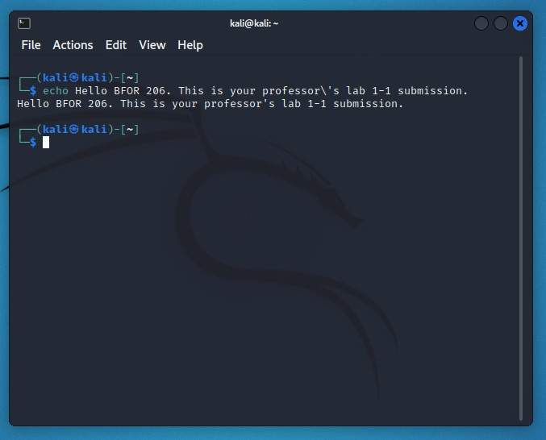

# BFOR 206 Lab
## Class 1-1: Virtual Machine Setup

# Task Description
Boot a Kali Linux Virtual Machine and open the terminal.
You will find a shortcut to the terminal in the information
bar at the top of the screen, on the left side.

# Input
There is no input for this lab.

# Output
To submit this lab, take a screenshot of your virtual
machine with the terminal running.

The screenshot should look like this (you do not need to `echo`
  some text like I did):

# Submission instructions
On Blackboard, please submit a screenshot that
clearly shows your terminal in a Kali VM. For
instructions on how to take a good screenshot,
see this article on
[WikiHow](https://www.wikihow.com/Take-a-Screen-Shot-(Screen-Capture)).
