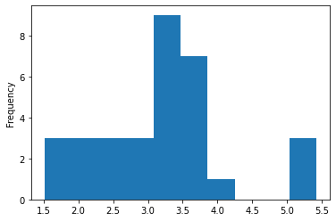

# BFOR 206 Lab
## Class 8-1: Data processing with `pandas`

# Task Description

In this lab, our task is to load in an external dataset
and produce some summary statistics and visualizations.

Before we can produce these results, we will first need to
clean the data somewhat.

# Normal Scenario

## Input
**File:** mtcars.csv

## Output
**Terminal:** Tables and plots as described below.

# Test Cases

## Case 1: Mean MPG by manufacturer
Summarize: show the mean mpg and hp for each company
in a table. For example:

| manufacturer     | mpg | hp     |
| :------------- | :------------- | :-- |
| AMC      | 15.20000    |  150.0000 |
| Cadillac | 10.400000   | 205.0000 |
| ... | ...  | ... |

## Case 2: Plot weight histogram
Plot a histogram of vehicle weights (`wt` column)

## Case 3: Extra Credit

Programmatically find and print the row for the vehicle with
the highest weight. That is, use a line of code (rather
  than sorting the dataframe in the data viewer). (1pt)

# Submission instructions

**Scripts that produce unhandled errors will not be accepted!**

Run your script to show that it produces output that
matches the test cases.

When you are finished, submit two screenshots on Blackboard:
1.  A screenshot of your code.
2.  A screenshot of output that looks very
    similar to the output in the test cases.
